# 📚 EbookStore (Built with .NET MVC)

An innovative e-commerce platform designed for seamless e-book shopping, 
featuring user-friendly interfaces, secure authentication, and robust admin management.

## 🧑‍💻 Tech Stack
### .NET Core MVC (Version 9)
A powerful framework for building scalable and maintainable web applications.

### Microsoft SQL Server 2022
The backbone database system for managing e-book data and user information.

### Entity Framework Core
Simplifies database interactions through an ORM (Object Relational Mapping) approach.

### Identity Core
Ensures secure user authentication and management within the application.

### Bootstrap 5
Responsive frontend framework for a modern, mobile-friendly UI.

## 🛠 Tools Used & Alternatives
Visual Studio 2022
Alternatives: .NET SDK + VS Code, .NET SDK + JetBrains Rider – lightweight IDEs for faster development.

Microsoft SQL Server Management Studio (SSMS)
Alternatives: Azure Data Studio, or SQL execution directly via terminal for simple queries.

📸 Project Screenshots
1.Registration

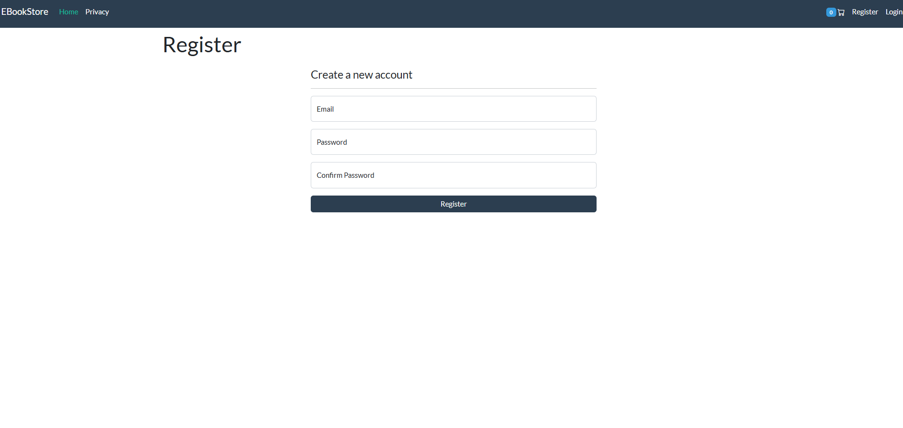

2.Login

3.Homepage

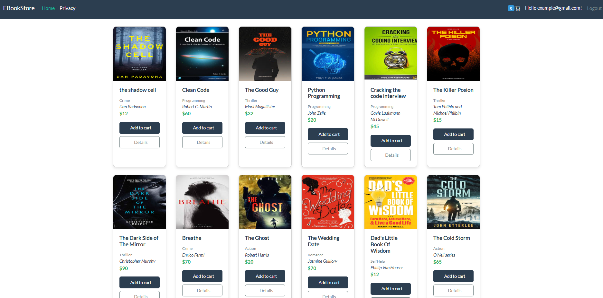

4.Details of Every Book

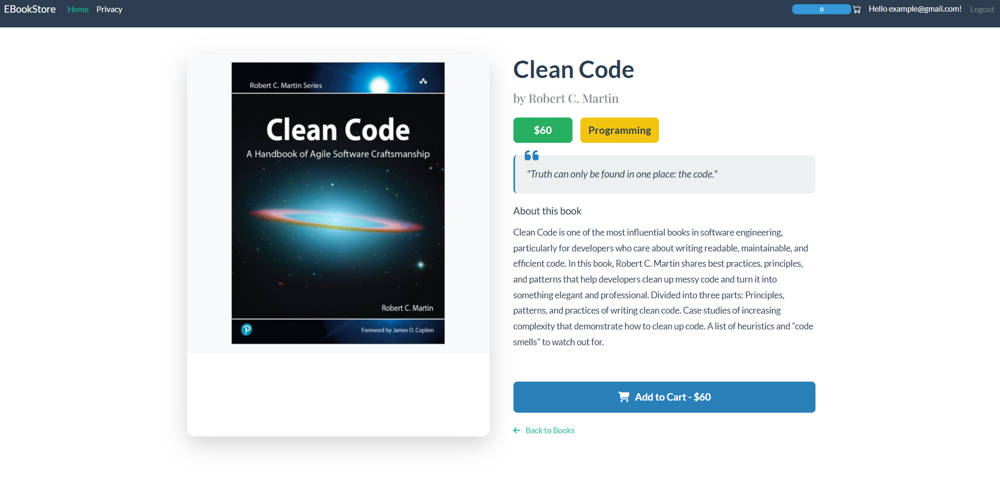

5.Add to Cart

6.CompleteCheckout

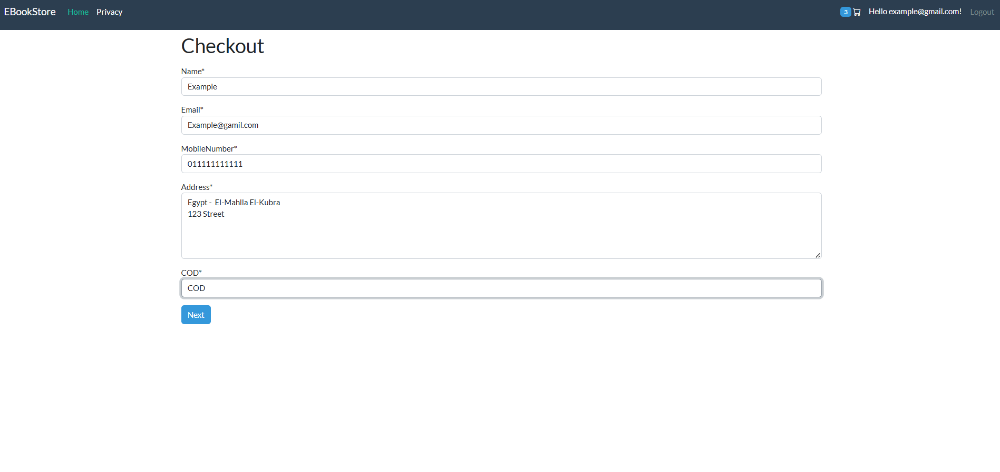

7.Order Success

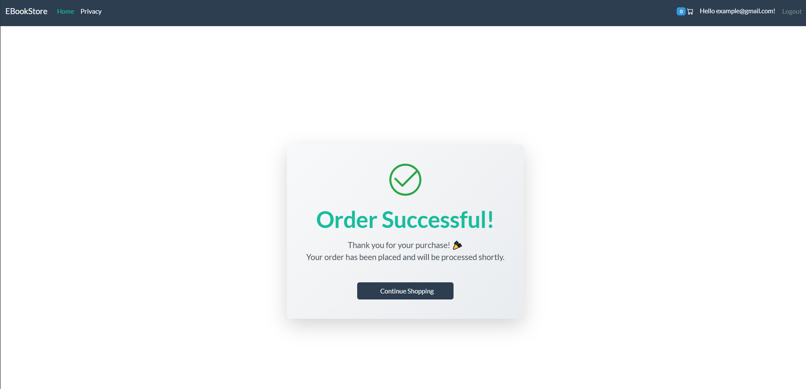

8.Admin Login

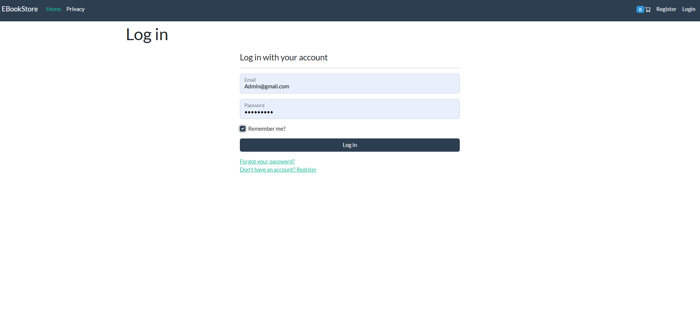

9.Orders

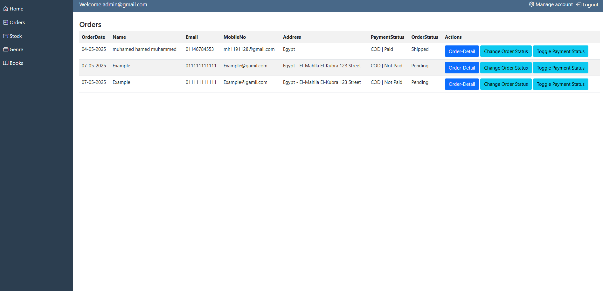

10.stock

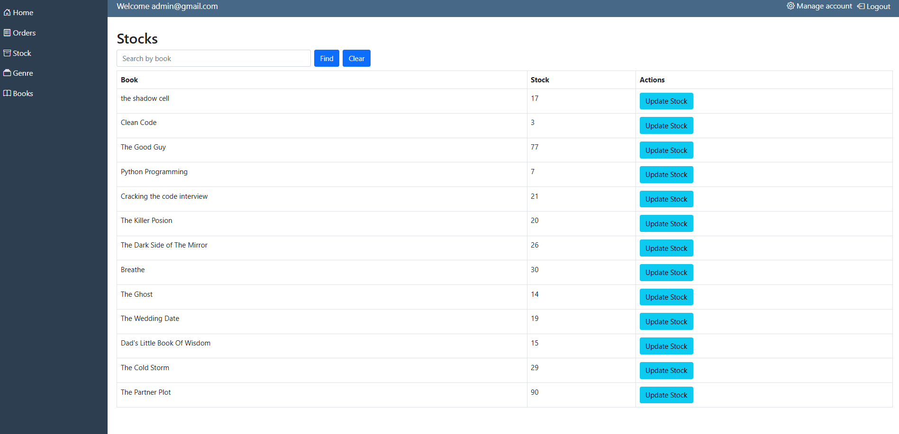

11.Genre

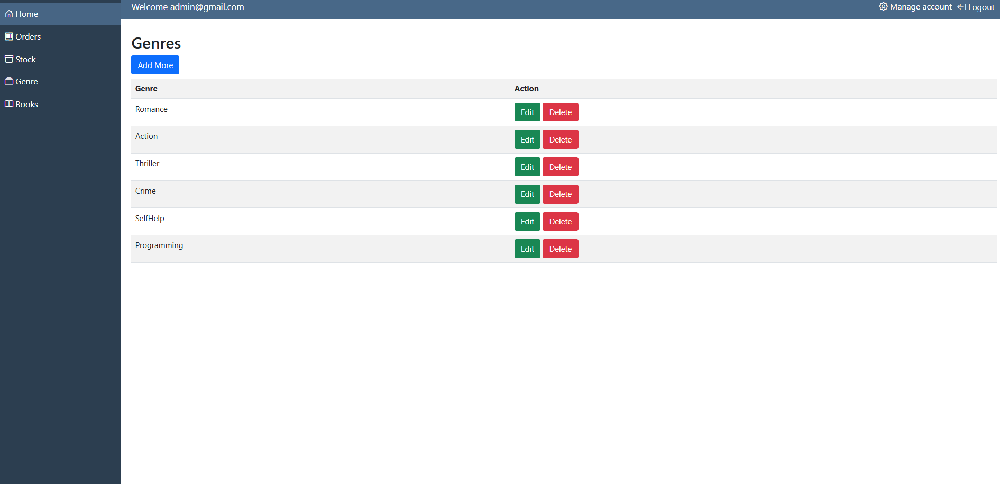

12.Books

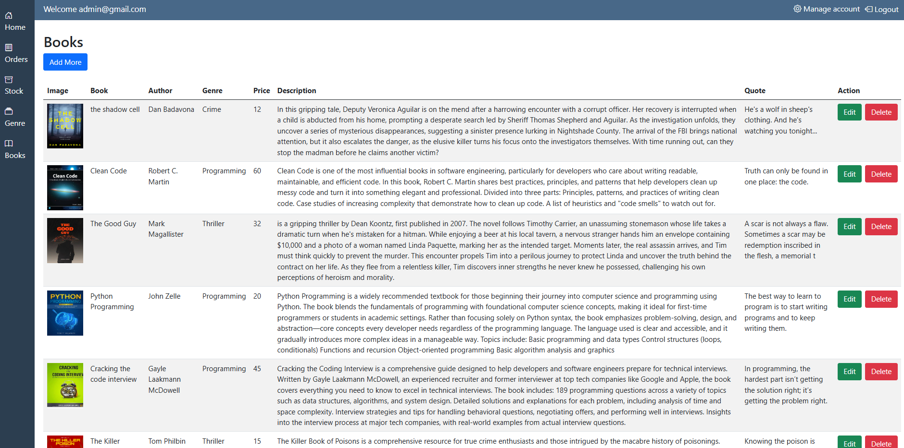

13.My Orders on Manage Account
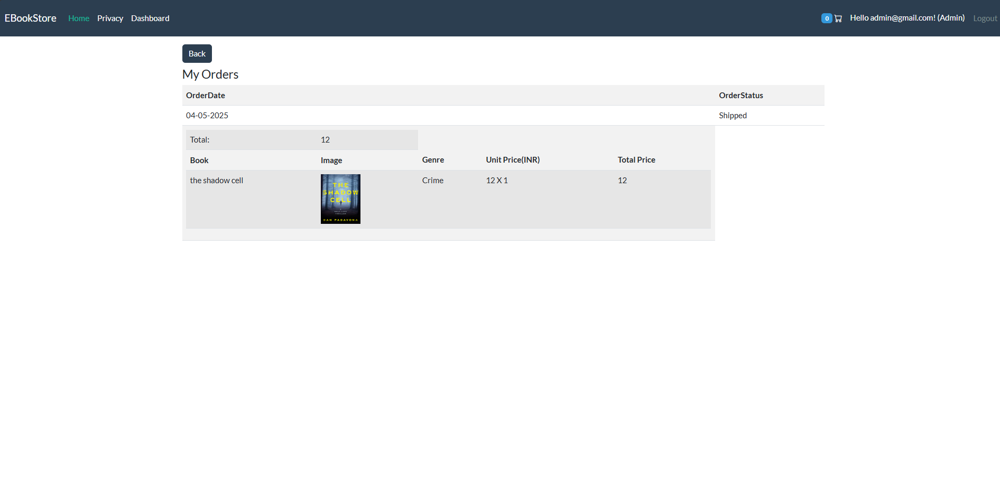

🌐 Connect with Me
Feel free to reach out or connect on LinkedIn for any questions or collaborations!

LinkedIn: Muhamed Hamed(www.linkedin.com/in/muhamed-hamed-muhamed-3a2a25250)

# MuhamedHamed | Passionate about creating seamless, user-centric applications
